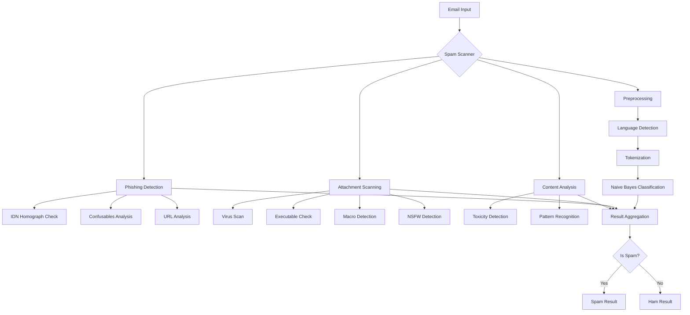
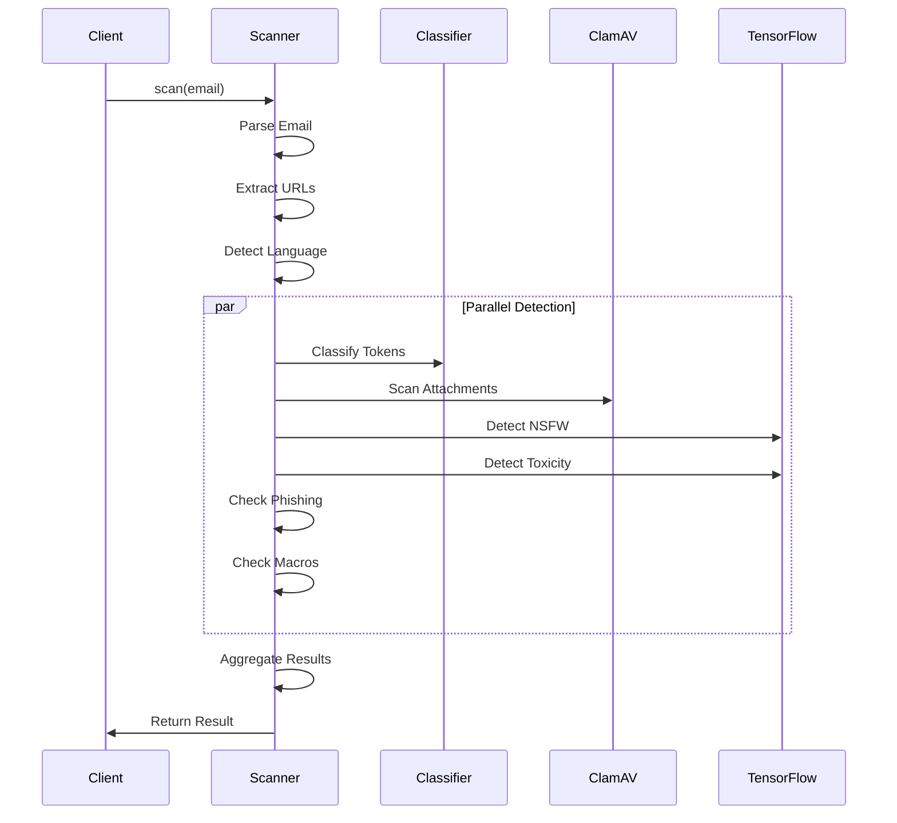
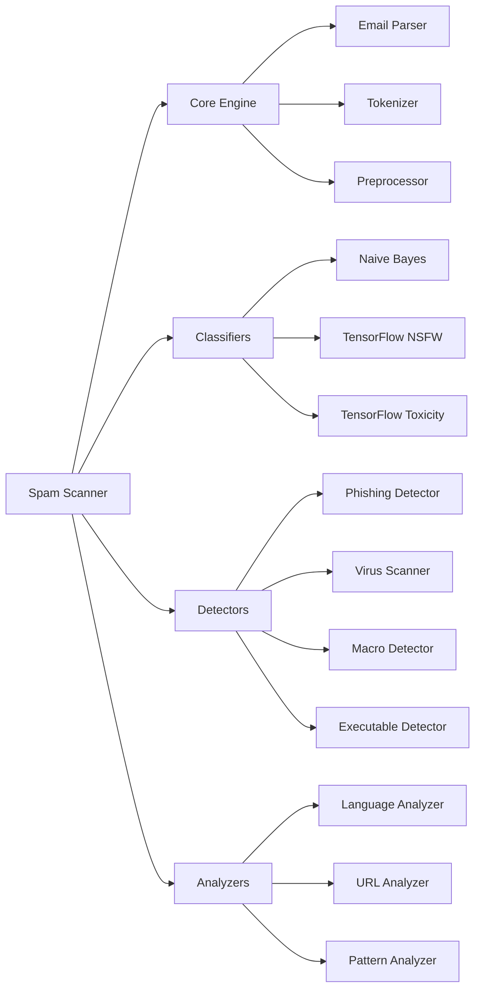

<h1 align="center">
  <a href="https://spamscanner.net"></a>
</h1>
<div align="center">
  <a href="https://github.com/spamscanner/spamscanner/actions/workflows/ci.yml"></a>
  <a href="https://github.com/sindresorhus/xo"></a>
  <a href="https://github.com/prettier/prettier"></a>
  <a href="https://lass.js.org"></a>
  <a href="LICENSE"></a>
</div>
<br />
<div align="center">
  Spam Scanner is the best <a href="https://en.wikipedia.org/wiki/Anti-spam_techniques" target="_blank">anti-spam</a>, <a href="https://en.wikipedia.org/wiki/Email_filtering" target="_blank">email filtering</a>, and <a href="https://en.wikipedia.org/wiki/Phishing" target="_blank">phishing prevention</a> service.
</div>
<hr />
<div align="center">
  Spam Scanner is a drop-in replacement and the best alternative to SpamAssassin, rspamd, SpamTitan, and more.
</div>
<hr />

> \[!NOTE]
> Spam Scanner is actively maintained and used in production at [Forward Email](https://forwardemail.net) to protect millions of emails daily.


## Table of Contents

* [Foreword](#foreword)
* [Installation](#installation)
  * [npm (Recommended)](#npm-recommended)
  * [Standalone Binary (No Node.js Required)](#standalone-binary-no-nodejs-required)
  * [ClamAV Installation (Optional)](#clamav-installation-optional)
* [CLI (Command Line Interface)](#cli-command-line-interface)
  * [CLI Installation](#cli-installation)
  * [Commands](#commands)
  * [Exit Codes](#exit-codes)
  * [CLI Examples](#cli-examples)
* [Why Spam Scanner](#why-spam-scanner)
  * [Key Advantages](#key-advantages)
* [Features](#features)
  * [Core Detection Features](#core-detection-features)
  * [Naive Bayes Classifier](#naive-bayes-classifier)
  * [Phishing Detection](#phishing-detection)
  * [Virus Scanning](#virus-scanning)
  * [Executable Detection](#executable-detection)
  * [NSFW Image Detection](#nsfw-image-detection)
  * [Toxicity Detection](#toxicity-detection)
  * [Macro Detection](#macro-detection)
  * [Language Detection](#language-detection)
  * [Pattern Recognition](#pattern-recognition)
  * [URL Analysis](#url-analysis)
* [Comparison](#comparison)
  * [Spam Scanner vs. Alternatives](#spam-scanner-vs-alternatives)
* [Architecture](#architecture)
  * [System Overview](#system-overview)
  * [Detection Flow](#detection-flow)
  * [Component Architecture](#component-architecture)
* [Requirements](#requirements)
  * [System Requirements](#system-requirements)
  * [Dependencies](#dependencies)
* [Quick Start](#quick-start)
  * [Basic Usage](#basic-usage)
  * [With Configuration](#with-configuration)
  * [Checking Specific Features](#checking-specific-features)
* [API Documentation](#api-documentation)
  * [Constructor Options](#constructor-options)
  * [Methods](#methods)
  * [Result Object](#result-object)
* [Advanced Usage](#advanced-usage)
  * [Custom Classifier](#custom-classifier)
  * [Custom Text Replacements](#custom-text-replacements)
  * [Language Filtering](#language-filtering)
  * [Performance Monitoring](#performance-monitoring)
  * [Selective Feature Disabling](#selective-feature-disabling)
  * [Custom Timeout](#custom-timeout)
  * [Custom Logger](#custom-logger)
* [ARF (Abuse Reporting Format)](#arf-abuse-reporting-format)
  * [Parsing ARF Reports](#parsing-arf-reports)
  * [Creating ARF Reports](#creating-arf-reports)
  * [ARF Result Object](#arf-result-object)
* [Mail Server Integration](#mail-server-integration)
  * [Postfix Integration](#postfix-integration)
  * [Dovecot Integration](#dovecot-integration)
  * [TCP Server Mode](#tcp-server-mode)
* [Performance](#performance)
  * [Benchmarks](#benchmarks)
  * [Optimization Tips](#optimization-tips)
  * [Memory Usage](#memory-usage)
* [Contributing](#contributing)
  * [Development Setup](#development-setup)
  * [Running Tests](#running-tests)
* [License](#license)
* [Support](#support)
* [Acknowledgments](#acknowledgments)


## Foreword

Spam Scanner is a tool and service created after hitting countless roadblocks with existing spam-detection solutions. In other words, it's our current [plan for spam](https://forwardemail.net/blog/our-plan-for-spam) and our [better plan for spam](https://forwardemail.net/blog/a-better-plan-for-spam).

Our goal is to build and utilize a scalable, performant, simple, easy to maintain, and powerful API for use in our service at [Forward Email](https://forwardemail.net) to limit spam and provide other measures to prevent attacks on our users.

Initially we tried using [SpamAssassin](https://spamassassin.apache.org), and later evaluated [rspamd](https://rspamd.com) – but in the end we learned that all existing solutions (even ones besides these) are overtly complex, missing required features or documentation, incredibly challenging to configure; high-barrier to entry, or have proprietary storage backends (that could store and read your messages without your consent) that limit our scalability.

To us, we value privacy and the security of our data and users – specifically we have a "Zero-Tolerance Policy" on storing logs or metadata of any kind, whatsoever (see our [Privacy Policy](https://forwardemail.net/privacy-policy) for more on that). None of these solutions honored this privacy policy (without removing essential spam-detection functionality), so we had to create our own tool – thus "Spam Scanner" was born.

---


## Installation

### npm (Recommended)

```bash
npm install spamscanner
```

For CLI usage:

```bash
# Install globally
npm install -g spamscanner

# Or use npx without installing
npx spamscanner scan email.eml
```

### Standalone Binary (No Node.js Required)

Download a pre-built binary for your platform. These are self-contained executables that don't require Node.js.

See [CLI Installation](#cli-installation) for download links and platform-specific instructions.

### ClamAV Installation (Optional)

#### macOS

```bash
brew install clamav
freshclam
```

#### Ubuntu/Debian

```bash
sudo apt-get update
sudo apt-get install clamav clamav-daemon
sudo freshclam
sudo systemctl start clamav-daemon
```

#### CentOS/RHEL

```bash
sudo yum install clamav clamav-update
sudo freshclam
```

> \[!TIP]
> See the [ClamAV configuration guide](https://github.com/spamscanner/spamscanner/blob/master/docs/clamav.md) for detailed installation instructions.

---


## CLI (Command Line Interface)

SpamScanner provides a command-line interface for scanning emails directly from the terminal or integrating with mail servers.

### CLI Installation

SpamScanner can be installed via npm or as a standalone binary. The standalone binary includes Node.js and all dependencies, so no additional runtime is required.

#### Install via npm (requires Node.js)

```bash
# Install globally
npm install -g spamscanner

# Or use npx without installing
npx spamscanner --help
```

#### Install Standalone Binary

##### macOS

```bash
# Using curl (Intel or Apple Silicon - auto-detected)
curl -fsSL https://github.com/spamscanner/spamscanner/releases/latest/download/spamscanner-darwin-$(uname -m | sed 's/x86_64/x64/' | sed 's/aarch64/arm64/' | sed 's/arm64/arm64/') -o /usr/local/bin/spamscanner
chmod +x /usr/local/bin/spamscanner

# Or download manually for Intel Mac
curl -fsSL https://github.com/spamscanner/spamscanner/releases/latest/download/spamscanner-darwin-x64 -o /usr/local/bin/spamscanner
chmod +x /usr/local/bin/spamscanner

# Or download manually for Apple Silicon (M1/M2/M3)
curl -fsSL https://github.com/spamscanner/spamscanner/releases/latest/download/spamscanner-darwin-arm64 -o /usr/local/bin/spamscanner
chmod +x /usr/local/bin/spamscanner
```

##### Linux

```bash
# Download and install to /usr/local/bin
sudo curl -fsSL https://github.com/spamscanner/spamscanner/releases/latest/download/spamscanner-linux-x64 -o /usr/local/bin/spamscanner
sudo chmod +x /usr/local/bin/spamscanner

# Or install to user directory (no sudo required)
mkdir -p ~/.local/bin
curl -fsSL https://github.com/spamscanner/spamscanner/releases/latest/download/spamscanner-linux-x64 -o ~/.local/bin/spamscanner
chmod +x ~/.local/bin/spamscanner
# Add to PATH if not already: export PATH="$HOME/.local/bin:$PATH"
```

##### Windows

```powershell
# Using PowerShell (run as Administrator)
Invoke-WebRequest -Uri "https://github.com/spamscanner/spamscanner/releases/latest/download/spamscanner-win-x64.exe" -OutFile "C:\Program Files\spamscanner\spamscanner.exe"
# Add to PATH via System Properties > Environment Variables

# Or download to current directory
Invoke-WebRequest -Uri "https://github.com/spamscanner/spamscanner/releases/latest/download/spamscanner-win-x64.exe" -OutFile ".\spamscanner.exe"
```

##### Verify Installation

```bash
# Check version
spamscanner version

# Check for updates
spamscanner update
```

#### Automatic Updates

SpamScanner CLI automatically checks for updates once every 24 hours and displays a notification if a new version is available. You can also manually check for updates:

```bash
# Check for updates
spamscanner update

# Disable automatic update checks
spamscanner scan email.eml --no-update-check
```

To update to the latest version, simply re-run the installation command for your platform or use npm:

```bash
# Update via npm
npm update -g spamscanner

# Or re-download the binary (macOS/Linux)
curl -fsSL https://github.com/spamscanner/spamscanner/releases/latest/download/spamscanner-$(uname -s | tr '[:upper:]' '[:lower:]')-$(uname -m | sed 's/x86_64/x64/' | sed 's/aarch64/arm64/') -o /usr/local/bin/spamscanner
chmod +x /usr/local/bin/spamscanner
```

### Commands

| Command                   | Description           |
| ------------------------- | --------------------- |
| `spamscanner scan <file>` | Scan an email file    |
| `spamscanner scan -`      | Scan email from stdin |
| `spamscanner server`      | Start TCP server mode |
| `spamscanner help`        | Show help message     |
| `spamscanner version`     | Show version number   |
| `spamscanner update`      | Check for updates     |

#### General Options

| Option              | Description                                   |
| ------------------- | --------------------------------------------- |
| `-h, --help`        | Show help                                     |
| `-v, --version`     | Show version                                  |
| `-j, --json`        | Output results as JSON                        |
| `--verbose`         | Show detailed output                          |
| `--debug`           | Enable debug mode                             |
| `--timeout <ms>`    | Scan timeout in milliseconds (default: 30000) |
| `--no-update-check` | Disable automatic update check                |

#### Spam Detection Options

SpamScanner calculates a spam score based on multiple detection methods. You can configure which checks are included and customize the score weights.

| Option                | Description                                       |
| --------------------- | ------------------------------------------------- |
| `--threshold <score>` | Spam score threshold (default: 5.0)               |
| `--check-classifier`  | Include Bayesian classifier in scoring (default)  |
| `--check-phishing`    | Include phishing detection in scoring (default)   |
| `--check-executables` | Include executable detection in scoring (default) |
| `--check-macros`      | Include macro detection in scoring (default)      |
| `--check-virus`       | Include virus detection in scoring (default)      |
| `--check-nsfw`        | Include NSFW detection in scoring (disabled)      |
| `--check-toxicity`    | Include toxicity detection in scoring (disabled)  |
| `--no-classifier`     | Disable Bayesian classifier scoring               |
| `--no-phishing`       | Disable phishing scoring                          |
| `--no-executables`    | Disable executable scoring                        |
| `--no-macros`         | Disable macro scoring                             |
| `--no-virus`          | Disable virus scoring                             |

#### Score Weights

Customize how much each detection type contributes to the total spam score:

| Option                   | Description                                 |
| ------------------------ | ------------------------------------------- |
| `--score-classifier <n>` | Classifier spam score weight (default: 5.0) |
| `--score-phishing <n>`   | Phishing score per issue (default: 5.0)     |
| `--score-executable <n>` | Executable score per file (default: 10.0)   |
| `--score-macro <n>`      | Macro score per detection (default: 5.0)    |
| `--score-virus <n>`      | Virus score per detection (default: 100.0)  |
| `--score-nsfw <n>`       | NSFW score per detection (default: 3.0)     |
| `--score-toxicity <n>`   | Toxicity score per detection (default: 3.0) |

#### Header Options

For mail server integration, SpamScanner can add X-Spam headers to emails (similar to [SpamAssassin](https://github.com/apache/spamassassin) and [Stalwart](https://github.com/stalwartlabs/stalwart)):

| Option                | Description                                |
| --------------------- | ------------------------------------------ |
| `--add-headers`       | Add X-Spam-* headers to output             |
| `--prepend-subject`   | Prepend [SPAM] to subject if spam detected |
| `--subject-tag <tag>` | Custom subject tag (default: [SPAM])       |

**X-Spam Headers Added:**

| Header          | Description                                                          |
| --------------- | -------------------------------------------------------------------- |
| `X-Spam-Status` | `Yes/No, score=X.X required=Y.Y tests=TEST1,TEST2,... version=X.X.X` |
| `X-Spam-Score`  | Numeric spam score (e.g., `7.5`)                                     |
| `X-Spam-Flag`   | `YES` or `NO`                                                        |
| `X-Spam-Tests`  | Comma-separated list of triggered tests                              |

#### Scanner Configuration Options

These options configure the underlying SpamScanner engine:

| Option                     | Description                                             |
| -------------------------- | ------------------------------------------------------- |
| `--languages <list>`       | Comma-separated language codes (default: all languages) |
| `--mixed-language`         | Enable mixed language detection in emails               |
| `--no-macro-detection`     | Disable macro detection in attachments                  |
| `--no-pattern-recognition` | Disable advanced pattern recognition                    |
| `--strict-idn`             | Enable strict IDN/homograph detection                   |
| `--nsfw-threshold <n>`     | NSFW detection threshold 0.0-1.0 (default: 0.6)         |
| `--toxicity-threshold <n>` | Toxicity detection threshold 0.0-1.0 (default: 0.7)     |
| `--clamscan-path <path>`   | Path to clamscan binary (default: /usr/bin/clamscan)    |
| `--clamdscan-path <path>`  | Path to clamdscan binary (default: /usr/bin/clamdscan)  |

##### Supported Languages

Use ISO 639-1 language codes with the `--languages` option. Pass an empty string or `all` to enable all languages (default).

| Code | Language        | Code | Language   | Code | Language   |
| ---- | --------------- | ---- | ---------- | ---- | ---------- |
| `en` | English         | `fr` | French     | `es` | Spanish    |
| `de` | German          | `it` | Italian    | `pt` | Portuguese |
| `ru` | Russian         | `ja` | Japanese   | `ko` | Korean     |
| `zh` | Chinese         | `ar` | Arabic     | `hi` | Hindi      |
| `bn` | Bengali         | `ur` | Urdu       | `tr` | Turkish    |
| `pl` | Polish          | `nl` | Dutch      | `sv` | Swedish    |
| `no` | Norwegian       | `da` | Danish     | `fi` | Finnish    |
| `hu` | Hungarian       | `cs` | Czech      | `sk` | Slovak     |
| `sl` | Slovenian       | `hr` | Croatian   | `sr` | Serbian    |
| `bg` | Bulgarian       | `ro` | Romanian   | `el` | Greek      |
| `he` | Hebrew          | `th` | Thai       | `vi` | Vietnamese |
| `id` | Indonesian      | `ms` | Malay      | `tl` | Tagalog    |
| `uk` | Ukrainian       | `be` | Belarusian | `lt` | Lithuanian |
| `lv` | Latvian         | `et` | Estonian   | `ca` | Catalan    |
| `eu` | Basque          | `gl` | Galician   | `ga` | Irish      |
| `gd` | Scottish Gaelic | `cy` | Welsh      | `is` | Icelandic  |
| `mt` | Maltese         | `af` | Afrikaans  | `sw` | Swahili    |
| `am` | Amharic         | `ha` | Hausa      | `yo` | Yoruba     |
| `ig` | Igbo            | `so` | Somali     | `om` | Oromo      |
| `ti` | Tigrinya        | `mg` | Malagasy   | `ny` | Chichewa   |
| `sn` | Shona           | `xh` | Xhosa      | `zu` | Zulu       |
| `st` | Southern Sotho  | `tn` | Tswana     |      |            |

#### Server Options

| Option          | Description                          |
| --------------- | ------------------------------------ |
| `--port <port>` | TCP server port (default: 7830)      |
| `--host <host>` | TCP server host (default: 127.0.0.1) |

### Exit Codes

| Code | Meaning          |
| ---- | ---------------- |
| `0`  | Clean (not spam) |
| `1`  | Spam detected    |
| `2`  | Error occurred   |

### CLI Examples

```bash
# Scan a file
spamscanner scan email.eml

# Scan from stdin (for Postfix integration)
cat email.eml | spamscanner scan -

# Scan with JSON output (includes score and tests)
spamscanner scan email.eml --json

# Scan with verbose output
spamscanner scan email.eml --verbose

# Scan with custom spam threshold
spamscanner scan email.eml --threshold 3.0

# Scan with only classifier and phishing checks
spamscanner scan email.eml --no-executables --no-macros --no-virus

# Scan and add X-Spam headers (for mail server integration)
spamscanner scan email.eml --add-headers

# Scan, add headers, and prepend [SPAM] to subject
spamscanner scan email.eml --add-headers --prepend-subject

# Scan with custom subject tag
spamscanner scan email.eml --add-headers --prepend-subject --subject-tag "[JUNK]"

# Enable NSFW and toxicity checks with custom weights
spamscanner scan email.eml --check-nsfw --check-toxicity --score-nsfw 5.0

# Start TCP server on custom port
spamscanner server --port 8080

# Start TCP server with custom threshold
spamscanner server --port 8080 --threshold 3.0

# Scan with specific language support (English, Spanish, French only)
spamscanner scan email.eml --languages en,es,fr

# Scan with mixed language detection enabled
spamscanner scan email.eml --mixed-language

# Scan with strict IDN/homograph detection
spamscanner scan email.eml --strict-idn

# Scan with custom NSFW threshold (more sensitive)
spamscanner scan email.eml --check-nsfw --nsfw-threshold 0.3

# Scan with custom ClamAV paths
spamscanner scan email.eml --clamscan-path /opt/clamav/bin/clamscan
```

#### Example JSON Output

```json
{
  "isSpam": true,
  "score": 7.5,
  "threshold": 5.0,
  "tests": ["BAYES_SPAM(5.0)", "PHISHING_DETECTED(2.5)"],
  "message": "Spam",
  "results": {
    "classification": { "category": "spam", "probability": 0.95 },
    "phishing": [{ "type": "suspicious_link", "url": "http://example.com" }]
  },
  "headers": {
    "X-Spam-Status": "Yes, score=7.5 required=5.0 tests=BAYES_SPAM(5.0),PHISHING_DETECTED(2.5) version=6.0.1",
    "X-Spam-Score": "7.5",
    "X-Spam-Flag": "YES",
    "X-Spam-Tests": "BAYES_SPAM(5.0), PHISHING_DETECTED(2.5)"
  }
}
```

---


## Why Spam Scanner

> \[!TIP]
> Spam Scanner is the only modern, privacy-focused, Node.js-based spam detection solution with AI-powered features.

### Key Advantages

* **🔒 Privacy-First** - Zero logging, zero metadata storage
* **🚀 Modern** - Built with Node.js 18+, ES modules, and latest AI models
* **🎯 Accurate** - 88%+ detection accuracy with Naive Bayes classifier
* **⚡ Fast** - Scans emails in under 3 seconds (with model caching)
* **🛡️ Comprehensive** - 10+ detection methods (virus, phishing, NSFW, toxicity, macros, etc.)
* **🌍 Multilingual** - Supports 40+ languages with automatic detection
* **🔧 Easy to Use** - Simple API, extensive documentation, TypeScript support
* **📊 Battle-Tested** - Used in production at Forward Email

---


## Features

Spam Scanner includes modern, essential, and performant features that help reduce spam, phishing, and executable attacks.

### Core Detection Features

| Feature                                               | Description                                                        | Status       |
| ----------------------------------------------------- | ------------------------------------------------------------------ | ------------ |
| **[Naive Bayes Classifier](#naive-bayes-classifier)** | Machine learning spam classification trained on 100K+ emails       | ✅ Production |
| **[Phishing Detection](#phishing-detection)**         | IDN homograph detection, confusables, suspicious link analysis     | ✅ Production |
| **[Virus Scanning](#virus-scanning)**                 | ClamAV integration for attachment scanning                         | ✅ Production |
| **[Executable Detection](#executable-detection)**     | Detects 195+ dangerous file extensions + magic number verification | ✅ Production |
| **[NSFW Image Detection](#nsfw-image-detection)**     | TensorFlow.js-powered image content analysis                       | ✅ Production |
| **[Toxicity Detection](#toxicity-detection)**         | AI-powered toxic language detection (threats, insults, harassment) | ✅ Production |
| **[Macro Detection](#macro-detection)**               | VBA, PowerShell, JavaScript, Batch script detection in attachments | ✅ Production |
| **[Language Detection](#language-detection)**         | Hybrid franc/lande detection for 40+ languages                     | ✅ Production |
| **[Pattern Recognition](#pattern-recognition)**       | Credit cards, phone numbers, IPs, Bitcoin addresses, etc.          | ✅ Production |
| **[URL Analysis](#url-analysis)**                     | TLD parsing, Cloudflare blocking detection, suspicious domains     | ✅ Production |

### Naive Bayes Classifier

Our Naive Bayesian classifier is available in this [repository](classifier.json), the npm package, and is updated frequently as it gains upstream, anonymous, SHA-256 hashed data from [Forward Email](https://forwardemail.net).

* **Training Data**: 100,000+ spam and ham emails
* **Accuracy**: 88%+ classification accuracy
* **Languages**: Supports 40+ languages with language-specific tokenization
* **Stemming**: Porter Stemmer for English, Snowball for 15+ other languages
* **Privacy**: All training data is anonymized and SHA-256 hashed

### Phishing Detection

Advanced phishing detection using multiple techniques:

* **IDN Homograph Detection**: Detects lookalike domains (e.g., `аpple.com` using Cyrillic "а")
* **Confusables Integration**: Uses Unicode confusables database to detect character substitution
* **TLD Analysis**: Validates TLDs and detects suspicious domain patterns
* **Link Analysis**: Checks for mismatched display text and actual URLs
* **Cloudflare Detection**: Identifies domains blocked by Cloudflare

### Virus Scanning

Integrates with ClamAV for comprehensive virus detection:

* **Real-time Scanning**: Scans all email attachments
* **Buffer Support**: Direct buffer scanning without file I/O
* **Timeout Protection**: Configurable scan timeouts
* **Virus Database**: Uses ClamAV's regularly updated virus definitions

### Executable Detection

Detects dangerous executable files:

* **195+ File Extensions**: exe, dll, bat, vbs, ps1, scr, pif, cmd, com, etc.
* **Magic Number Verification**: Detects renamed executables by file content
* **Office Macros**: Detects macro-enabled Office documents (docm, xlsm, pptm)
* **Legacy Office**: Flags legacy Office formats (doc, xls, ppt) as high-risk
* **PDF JavaScript**: Detects malicious JavaScript in PDF files
* **Archive Detection**: Flags archives (zip, rar, 7z) that may hide executables

### NSFW Image Detection

AI-powered image content analysis using TensorFlow\.js:

* **Categories**: Porn, Hentai, Sexy, Neutral, Drawing
* **Model**: NSFWJS model trained on 60K+ images
* **Threshold**: Configurable detection threshold (default: 0.7)
* **Performance**: Model caching for fast subsequent scans
* **Formats**: Supports JPEG, PNG, GIF, WebP, BMP

### Toxicity Detection

Detects toxic language using TensorFlow\.js Toxicity model:

* **Categories**: Identity attack, insult, obscenity, severe toxicity, sexual explicit, threat
* **Threshold**: Configurable toxicity threshold (default: 0.7)
* **Languages**: Optimized for English, supports other languages
* **Performance**: Model caching for fast subsequent scans

### Macro Detection

Detects malicious macros in email content and attachments:

* **VBA Macros**: Detects Visual Basic for Applications code
* **PowerShell**: Detects PowerShell scripts and commands
* **JavaScript**: Detects JavaScript code in emails
* **Batch Scripts**: Detects Windows batch files
* **Office Documents**: Scans docm, xlsm, pptm, xlam, dotm, xltm, potm
* **PDF JavaScript**: Detects JavaScript in PDF attachments

### Language Detection

Hybrid language detection using franc and lande:

* **40+ Languages**: Supports all major world languages
* **Automatic Detection**: Detects language from email content
* **Fallback System**: Uses lande when franc returns "undetermined"
* **Mixed Language Support**: Optional mixed language detection
* **Language Filtering**: Filter results to supported languages only

### Pattern Recognition

Detects various patterns in email content:

* **Credit Cards**: Visa, MasterCard, Amex, Discover, etc.
* **Phone Numbers**: International phone number formats
* **Email Addresses**: RFC-compliant email detection
* **IP Addresses**: IPv4 and IPv6 addresses
* **URLs**: Full URL extraction and analysis
* **Bitcoin Addresses**: Cryptocurrency wallet addresses
* **MAC Addresses**: Network hardware addresses
* **Hex Colors**: Color codes (#RRGGBB)
* **Floating Point Numbers**: Decimal numbers
* **Dates**: Multiple date formats (MM/DD/YYYY, YYYY-MM-DD, etc.)
* **File Paths**: Windows and Unix file paths

### URL Analysis

Comprehensive URL analysis and validation:

* **TLD Parsing**: Uses tldts for accurate TLD extraction
* **Domain Analysis**: Extracts domain, subdomain, public suffix
* **IP Detection**: Identifies IP-based URLs
* **Cloudflare Check**: Detects Cloudflare-blocked domains
* **URL Normalization**: Normalizes URLs for consistent analysis
* **Suspicious Pattern Detection**: Identifies phishing URL patterns

---


## Comparison

### Spam Scanner vs. Alternatives

| Feature                       | Spam Scanner |  SpamAssassin |     rspamd    |  ClamAV |
| ----------------------------- | :----------: | :-----------: | :-----------: | :-----: |
| **License**                   |    BSL 1.1   |   Apache 2.0  |   Apache 2.0  |  GPLv2  |
| **Language**                  |    Node.js   |      Perl     |       C       |    C    |
| **Modern Architecture**       |      Yes     |       No      |    Partial    |    No   |
| **Easy to Use**               |      Yes     |       No      |       No      |   Yes   |
| **Privacy-Focused**           |      Yes     |    Partial    |    Partial    |   Yes   |
| **Naive Bayes Classifier**    |      Yes     |      Yes      |      Yes      |    No   |
| **Virus Scanning**            |      Yes     |      Yes      |      Yes      |   Yes   |
| **Phishing Detection**        |      Yes     |      Yes      |      Yes      |    No   |
| **IDN Homograph Detection**   |      Yes     |       No      |      Yes      |    No   |
| **NSFW Image Detection**      |      Yes     |       No      |       No      |    No   |
| **Toxicity Detection**        |      Yes     |       No      |       No      |    No   |
| **Macro Detection**           |      Yes     |      Yes      |      Yes      |   Yes   |
| **Language Detection**        |   Yes (40+)  | Yes (limited) | Yes (limited) |    No   |
| **Pattern Recognition**       |      Yes     |      Yes      |      Yes      |    No   |
| **Executable Detection**      |  Yes (195+)  |      Yes      |      Yes      |   Yes   |
| **Magic Number Verification** |      Yes     |       No      |       No      |   Yes   |
| **PDF JavaScript Detection**  |      Yes     |       No      |       No      | Partial |
| **Archive Detection**         |      Yes     |      Yes      |      Yes      |   Yes   |
| **Performance Metrics**       |      Yes     |       No      |      Yes      |    No   |
| **TypeScript Support**        |      Yes     |       No      |       No      |    No   |
| **Active Development**        |      Yes     |      Yes      |      Yes      |   Yes   |
| **Production Ready**          |      Yes     |      Yes      |      Yes      |   Yes   |

> \[!NOTE]
> **Alternative to SpamAssassin**: Spam Scanner provides a modern, Node.js-based alternative to SpamAssassin with AI-powered features and better privacy.
>
> **Alternative to rspamd**: Spam Scanner offers easier configuration and better documentation than rspamd, with comparable detection accuracy.
>
> **Alternative to ClamAV**: While Spam Scanner uses ClamAV for virus scanning, it provides comprehensive spam and phishing detection that ClamAV doesn't offer.

---


## Architecture

### System Overview



### Detection Flow



### Component Architecture



---


## Requirements

> \[!WARNING]
> ClamAV is required for virus scanning. If you do not have it installed, virus scanning will be disabled.

### System Requirements

* **Node.js**: >= 18.0.0
* **ClamAV**: Latest version (for virus scanning)
* **Memory**: 2GB+ RAM recommended (for TensorFlow models)
* **Disk Space**: 500MB+ (for models and virus definitions)

### Dependencies

* **@tensorflow/tfjs-node**: For NSFW and toxicity detection
* **@ladjs/naivebayes**: For spam classification
* **clamscan**: For virus scanning
* **mailparser**: For email parsing
* **natural**: For NLP and tokenization
* **tldts**: For TLD parsing
* **confusables**: For Unicode confusables detection

---


## Quick Start

### Basic Usage

```js
import SpamScanner from 'spamscanner';

const scanner = new SpamScanner();

// Raw email string or Buffer
const email = `
From: sender@example.com
To: recipient@example.com
Subject: Test Email

This is a test email.
`;

const result = await scanner.scan(email);

console.log(result);
// {
//   isSpam: false,
//   message: 'Ham',
//   results: { ... },
//   ...
// }
```

### With Configuration

```js
import SpamScanner from 'spamscanner';

const scanner = new SpamScanner({
  // Enable performance metrics
  enablePerformanceMetrics: true,

  // Filter to supported languages
  supportedLanguages: ['en', 'es', 'fr', 'de'],

  // Enable macro detection
  enableMacroDetection: true,

  // Set scan timeout
  timeout: 30000,

  // Custom ClamAV configuration
  clamscan: {
    preference: 'clamdscan',
    clamdscanPath: '/usr/bin/clamdscan',
  },
});

const result = await scanner.scan(email);
```

### Checking Specific Features

```js
// Check if email is spam
if (result.isSpam) {
  console.log('Spam detected!');
  console.log('Reason:', result.message);
}

// Check for viruses
if (result.results.viruses && result.results.viruses.length > 0) {
  console.log('Viruses found:', result.results.viruses);
}

// Check for phishing
if (result.results.phishing && result.results.phishing.length > 0) {
  console.log('Phishing detected:', result.results.phishing);
}

// Check for executables
if (result.results.executables && result.results.executables.length > 0) {
  console.log('Executables found:', result.results.executables);
}

// Check for NSFW content
if (result.results.nsfw && result.results.nsfw.length > 0) {
  console.log('NSFW content detected:', result.results.nsfw);
}

// Check for toxic language
if (result.results.toxicity && result.results.toxicity.length > 0) {
  console.log('Toxic language detected:', result.results.toxicity);
}
```

---


## API Documentation

### Constructor Options

#### `new SpamScanner(options)`

Creates a new Spam Scanner instance.

##### Options

| Option                             | Type          | Default   | Description                                                                   |
| ---------------------------------- | ------------- | --------- | ----------------------------------------------------------------------------- |
| `enableMacroDetection`             | `boolean`     | `true`    | Enable macro detection in emails and attachments                              |
| `enablePerformanceMetrics`         | `boolean`     | `false`   | Track and return performance metrics                                          |
| `timeout`                          | `number`      | `30000`   | Timeout in milliseconds for scans (virus, URL checks)                         |
| `supportedLanguages`               | `string[]`    | `['en']`  | Array of supported language codes. Empty array `[]` = all languages supported |
| `enableMixedLanguageDetection`     | `boolean`     | `false`   | Enable detection of mixed languages in emails                                 |
| `enableAdvancedPatternRecognition` | `boolean`     | `true`    | Enable advanced pattern recognition (credit cards, phones, etc.)              |
| `toxicityThreshold`                | `number`      | `0.7`     | Threshold for toxicity detection (0.0-1.0, higher = more strict)              |
| `nsfwThreshold`                    | `number`      | `0.6`     | Threshold for NSFW detection (0.0-1.0, higher = more strict)                  |
| `debug`                            | `boolean`     | `false`   | Enable debug logging                                                          |
| `logger`                           | `object`      | `console` | Custom logger object (must have `log`, `error`, `warn` methods)               |
| `clamscan`                         | `object`      | See below | ClamAV configuration options                                                  |
| `classifier`                       | `object`      | `null`    | Custom Naive Bayes classifier data                                            |
| `replacements`                     | `Map\|object` | `null`    | Custom text replacements for preprocessing                                    |

##### ClamAV Options (`clamscan`)

| Option               | Type           | Default                | Description                                      |
| -------------------- | -------------- | ---------------------- | ------------------------------------------------ |
| `removeInfected`     | `boolean`      | `false`                | Remove infected files                            |
| `quarantineInfected` | `boolean`      | `false`                | Quarantine infected files                        |
| `scanLog`            | `string\|null` | `null`                 | Path to scan log file                            |
| `debugMode`          | `boolean`      | `false`                | Enable ClamAV debug mode                         |
| `fileList`           | `string\|null` | `null`                 | Path to file list                                |
| `scanRecursively`    | `boolean`      | `true`                 | Scan directories recursively                     |
| `clamscanPath`       | `string`       | `'/usr/bin/clamscan'`  | Path to clamscan binary                          |
| `clamdscanPath`      | `string`       | `'/usr/bin/clamdscan'` | Path to clamdscan binary                         |
| `preference`         | `string`       | `'clamdscan'`          | Preferred scanner: `'clamdscan'` or `'clamscan'` |

##### Example

```js
const scanner = new SpamScanner({
  enableMacroDetection: true,
  enablePerformanceMetrics: true,
  timeout: 60000,
  supportedLanguages: ['en', 'es', 'fr', 'de', 'ja', 'zh'],
  enableMixedLanguageDetection: false,
  enableAdvancedPatternRecognition: true,
  debug: false,
  logger: console,
  clamscan: {
    preference: 'clamdscan',
    clamdscanPath: '/usr/bin/clamdscan',
    scanRecursively: true,
    debugMode: false,
  },
});
```

---

### Methods

#### `scanner.scan(source)`

Scans an email for spam, viruses, phishing, and other threats.

##### Parameters

* `source` (`string` | `Buffer`) - Raw email content (RFC 822 format)

##### Returns

`Promise<object>` - Scan result object (see [Result Object](#result-object))

##### Example

```js
const result = await scanner.scan(emailString);
```

##### Edge Cases

* **Empty email**: Returns `isSpam: false` with empty results
* **Invalid email format**: Attempts to parse, may return partial results
* **Timeout**: Returns partial results if scan exceeds `timeout` option
* **ClamAV unavailable**: Skips virus scanning, continues with other checks
* **TensorFlow model loading**: First scan may take 30+ seconds, subsequent scans are fast (models cached)

---

#### `scanner.getTokensAndMailFromSource(source)`

Parses email and extracts tokens for classification.

##### Parameters

* `source` (`string` | `Buffer`) - Raw email content

##### Returns

`Promise<object>` - Object with `tokens` (array) and `mail` (parsed email object)

##### Example

```js
const {tokens, mail} = await scanner.getTokensAndMailFromSource(emailString);
console.log('Tokens:', tokens);
console.log('Subject:', mail.subject);
```

---

#### `scanner.getClassification(tokens)`

Classifies tokens as spam or ham using Naive Bayes classifier.

##### Parameters

* `tokens` (`string[]`) - Array of tokens from email

##### Returns

`Promise<object>` - Classification result with `category` and `probability`

##### Example

```js
const classification = await scanner.getClassification(tokens);
console.log('Category:', classification.category); // 'spam' or 'ham'
console.log('Probability:', classification.probability); // 0.0 - 1.0
```

---

#### `scanner.getPhishingResults(mail)`

Detects phishing attempts in email.

##### Parameters

* `mail` (`object`) - Parsed email object from `mailparser`

##### Returns

`Promise<array>` - Array of phishing detection results

##### Example

```js
const phishing = await scanner.getPhishingResults(mail);
// [
//   {
//     type: 'idn_homograph',
//     domain: 'аpple.com',
//     message: 'IDN homograph attack detected'
//   }
// ]
```

---

#### `scanner.getExecutableResults(mail)`

Detects executable files in email attachments.

##### Parameters

* `mail` (`object`) - Parsed email object from `mailparser`

##### Returns

`Promise<array>` - Array of executable detection results

##### Example

```js
const executables = await scanner.getExecutableResults(mail);
// [
//   {
//     filename: 'malware.exe',
//     type: 'executable',
//     extension: 'exe',
//     risk: 'high'
//   }
// ]
```

---

#### `scanner.getVirusResults(mail)`

Scans email attachments for viruses using ClamAV.

##### Parameters

* `mail` (`object`) - Parsed email object from `mailparser`

##### Returns

`Promise<array>` - Array of virus detection results

##### Example

```js
const viruses = await scanner.getVirusResults(mail);
// [
//   {
//     filename: 'infected.pdf',
//     virus: ['Trojan.PDF.Generic'],
//     type: 'virus'
//   }
// ]
```

---

#### `scanner.getMacroResults(mail)`

Detects macros in email content and attachments.

##### Parameters

* `mail` (`object`) - Parsed email object from `mailparser`

##### Returns

`Promise<array>` - Array of macro detection results

##### Example

```js
const macros = await scanner.getMacroResults(mail);
// [
//   {
//     type: 'vba_macro',
//     message: 'VBA macro detected in email content'
//   }
// ]
```

---

#### `scanner.getNSFWResults(mail)`

Detects NSFW content in image attachments using TensorFlow\.js.

##### Parameters

* `mail` (`object`) - Parsed email object from `mailparser`

##### Returns

`Promise<array>` - Array of NSFW detection results

##### Example

```js
const nsfw = await scanner.getNSFWResults(mail);
// [
//   {
//     type: 'nsfw',
//     filename: 'image.jpg',
//     category: 'Porn',
//     probability: 0.85,
//     description: 'NSFW image detected: Porn (85.0%)'
//   }
// ]
```

---

#### `scanner.getToxicityResults(mail)`

Detects toxic language in email content using TensorFlow\.js.

##### Parameters

* `mail` (`object`) - Parsed email object from `mailparser`

##### Returns

`Promise<array>` - Array of toxicity detection results

##### Example

```js
const toxicity = await scanner.getToxicityResults(mail);
// [
//   {
//     type: 'toxicity',
//     category: 'threat',
//     probability: 0.92,
//     description: 'Toxic content detected: threat (92.0%)'
//   },
//   {
//     type: 'toxicity',
//     category: 'insult',
//     probability: 0.78,
//     description: 'Toxic content detected: insult (78.0%)'
//   }
// ]
```

---

#### `scanner.getTokens(str, locale, isHTML)`

Tokenizes text for classification.

##### Parameters

* `str` (`string`) - Text to tokenize
* `locale` (`string`) - Language code (e.g., "en", "es", "fr")
* `isHTML` (`boolean`) - Whether text contains HTML (default: `false`)

##### Returns

`Promise<string[]>` - Array of tokens

##### Example

```js
const tokens = await scanner.getTokens('Hello world', 'en', false);
// ['hello', 'world']
```

---

#### `scanner.parseLocale(locale)`

Normalizes language codes to standard format.

##### Parameters

* `locale` (`string`) - Language code or locale string

##### Returns

`string` - Normalized language code

##### Example

```js
const normalized = scanner.parseLocale('en-US');
// 'en'
```

---

#### `scanner.detectLanguageHybrid(text)`

Detects language using hybrid franc/lande approach.

##### Parameters

* `text` (`string`) - Text to analyze

##### Returns

`Promise<string>` - Detected language code

##### Example

```js
const language = await scanner.detectLanguageHybrid('Bonjour le monde');
// 'fr'
```

---

#### `scanner.extractAllUrls(mail, originalSource)`

Extracts all URLs from email.

##### Parameters

* `mail` (`object`) - Parsed email object
* `originalSource` (`string`) - Original email source

##### Returns

`string[]` - Array of URLs

##### Example

```js
const urls = scanner.extractAllUrls(mail, emailString);
// ['https://example.com', 'http://test.com']
```

---

#### `scanner.parseUrlWithTldts(url)`

Parses URL using tldts for accurate TLD extraction.

##### Parameters

* `url` (`string`) - URL to parse

##### Returns

`object` - Parsed URL components

##### Example

```js
const parsed = scanner.parseUrlWithTldts('https://subdomain.example.co.uk/path');
// {
//   domain: 'example.co.uk',
//   subdomain: 'subdomain',
//   hostname: 'subdomain.example.co.uk',
//   publicSuffix: 'co.uk',
//   isIp: false
// }
```

---

### Result Object

The `scan()` method returns a comprehensive result object:

```js
{
  // Overall spam classification
  isSpam: boolean,
  message: string, // 'Ham' or 'Spam: <reasons>'

  // Detection results
  results: {
    // Classification details
    classification: {
      category: 'spam' | 'ham',
      probability: number
    },

    // Phishing detection
    phishing: [
      {
        type: 'idn_homograph' | 'suspicious_link' | 'confusables',
        domain: string,
        message: string
      }
    ],

    // Executable detection
    executables: [
      {
        filename: string,
        type: 'executable' | 'office_document' | 'legacy_office' | 'pdf_javascript' | 'archive',
        extension: string,
        risk: 'high' | 'medium' | 'low'
      }
    ],

    // Macro detection
    macros: [
      {
        type: 'vba_macro' | 'powershell' | 'javascript' | 'batch',
        message: string
      }
    ],

    // Arbitrary results (custom detections)
    arbitrary: [],

    // Virus scanning
    viruses: [
      {
        filename: string,
        virus: string[],
        type: 'virus'
      }
    ],

    // Pattern recognition
    patterns: {
      credit_cards: number,
      phone_numbers: number,
      emails: number,
      ips: number,
      urls: number,
      bitcoin: number,
      dates: number,
      file_paths: number
    },

    // IDN homograph attack detection
    idnHomographAttack: [],

    // Toxicity detection (array of results)
    toxicity: [
      {
        type: 'toxicity',
        category: 'identity_attack' | 'insult' | 'obscene' | 'severe_toxicity' | 'sexual_explicit' | 'threat',
        probability: number,
        description: string
      }
    ],

    // NSFW detection (array of results)
    nsfw: [
      {
        type: 'nsfw',
        filename: string,
        category: 'Porn' | 'Hentai' | 'Sexy' | 'Neutral' | 'Drawing',
        probability: number,
        description: string
      }
    ]
  },

  // All URLs extracted from email
  links: string[],

  // Tokens extracted from email
  tokens: string[],

  // Email metadata
  mail: {
    from: object,
    to: object[],
    subject: string,
    text: string,
    html: string,
    attachments: object[],
    headers: object
  },

  // Performance metrics (if enabled)
  metrics: {
    totalTime: number, // milliseconds
    classificationTime: number,
    phishingTime: number,
    executableTime: number,
    macroTime: number,
    virusTime: number,
    patternTime: number,
    idnTime: number,
    memoryUsage: object
  }
}
```

---


## Advanced Usage

### Custom Classifier

```js
import SpamScanner from 'spamscanner';
import NaiveBayes from '@ladjs/naivebayes';

// Train custom classifier
const classifier = new NaiveBayes();
classifier.learn('buy viagra now', 'spam');
classifier.learn('hello friend', 'ham');

const scanner = new SpamScanner({
  classifier: classifier.toJson()
});
```

### Custom Text Replacements

```js
const scanner = new SpamScanner({
  replacements: new Map([
    ['u', 'you'],
    ['ur', 'your'],
    ['r', 'are'],
    ['b4', 'before']
  ])
});
```

### Language Filtering

```js
// Only accept English, Spanish, and French emails
const scanner = new SpamScanner({
  supportedLanguages: ['en', 'es', 'fr']
});

// Accept all languages
const scanner2 = new SpamScanner({
  supportedLanguages: []
});
```

### Performance Monitoring

```js
const scanner = new SpamScanner({
  enablePerformanceMetrics: true
});

const result = await scanner.scan(email);

console.log('Total scan time:', result.metrics.totalTime, 'ms');
console.log('Classification time:', result.metrics.classificationTime, 'ms');
console.log('Virus scan time:', result.metrics.virusScanTime, 'ms');
```

### Selective Feature Disabling

```js
// Disable macro detection for performance
const scanner = new SpamScanner({
  enableMacroDetection: false
});

// Disable advanced pattern recognition
const scanner2 = new SpamScanner({
  enableAdvancedPatternRecognition: false
});
```

### Custom Timeout

```js
// Set 60-second timeout for slow scans
const scanner = new SpamScanner({
  timeout: 60000
});
```

### Custom Logger

```js
import winston from 'winston';

const logger = winston.createLogger({
  level: 'info',
  format: winston.format.json(),
  transports: [
    new winston.transports.File({ filename: 'spam-scanner.log' })
  ]
});

const scanner = new SpamScanner({
  debug: true,
  logger: logger
});
```

---


## ARF (Abuse Reporting Format)

SpamScanner includes a native [ARF (Abuse Reporting Format)](https://www.rfc-editor.org/rfc/rfc5965.html) parser for handling email feedback reports from ISPs and email providers.

### Parsing ARF Reports

```js
import {ArfParser} from 'spamscanner/arf';
import fs from 'node:fs';

// Read an ARF report email
const arfEmail = fs.readFileSync('feedback_report.eml');

// Parse the ARF report
const report = await ArfParser.parse(arfEmail);

console.log('Feedback Type:', report.feedbackType);
console.log('Source IP:', report.sourceIp);
console.log('Original Sender:', report.originalMailFrom);
console.log('Original Recipients:', report.originalRcptTo);
```

#### Safe Parsing

```js
// Use tryParse for safe parsing (returns null if not ARF)
const report = await ArfParser.tryParse(emailContent);

if (report) {
  console.log('ARF report detected:', report.feedbackType);
} else {
  console.log('Not an ARF report');
}
```

### Creating ARF Reports

```js
import {ArfParser} from 'spamscanner/arf';

const arfMessage = ArfParser.create({
  feedbackType: 'abuse',
  userAgent: 'MyMailServer/1.0',
  from: 'abuse@yourdomain.com',
  to: 'abuse@theirisp.com',
  originalMessage: originalEmailContent,
  humanReadable: 'This email was reported as spam by our users.',
  sourceIp: '192.168.1.100',
  originalMailFrom: 'spammer@example.com',
  originalRcptTo: ['victim@yourdomain.com'],
  arrivalDate: new Date(),
  reportingMta: 'mail.yourdomain.com',
});

// Send arfMessage to the abuse address
```

### ARF Result Object

| Property           | Type       | Description                                                                   |
| ------------------ | ---------- | ----------------------------------------------------------------------------- |
| `isArf`            | `boolean`  | Whether this is a valid ARF message                                           |
| `feedbackType`     | `string`   | Type: `abuse`, `fraud`, `virus`, `other`, `not-spam`, `auth-failure`, `dmarc` |
| `userAgent`        | `string`   | User agent that generated the report                                          |
| `version`          | `string`   | ARF version (usually "1")                                                     |
| `sourceIp`         | `string`   | Source IP of the original message                                             |
| `originalMailFrom` | `string`   | Original MAIL FROM address                                                    |
| `originalRcptTo`   | `string[]` | Original RCPT TO addresses                                                    |
| `arrivalDate`      | `Date`     | When the original message arrived                                             |
| `reportingMta`     | `object`   | Reporting MTA info (`{type, name}`)                                           |
| `incidents`        | `number`   | Number of incidents reported                                                  |
| `humanReadable`    | `string`   | Human-readable description                                                    |
| `originalMessage`  | `string`   | The original reported message                                                 |
| `originalHeaders`  | `object`   | Parsed headers from original message                                          |

---


## Mail Server Integration

SpamScanner can be integrated with popular mail servers like [Postfix](https://www.postfix.org/) and [Dovecot](https://www.dovecot.org/) as a content filter.

### Postfix Integration

#### Using Pipe Content Filter

This is the recommended method for most Postfix setups.

1. **Create a dedicated user** (recommended for security):

```bash
sudo useradd -r -s /bin/false spamscanner
```

2. **Edit `/etc/postfix/master.cf`**:

```cf
# SpamScanner content filter
spamscanner unix - n n - - pipe
  flags=Rq user=spamscanner argv=/usr/local/bin/spamscanner scan -
```

3. **Edit `/etc/postfix/main.cf`**:

```cf
content_filter = spamscanner:dummy
```

4. **Reload Postfix**:

```bash
sudo postfix reload
```

Postfix will now pipe all incoming emails to SpamScanner. If SpamScanner exits with code 1 (spam), Postfix will reject the message.

### Dovecot Integration

#### Using Sieve and Pipe

1. **Enable Pigeonhole Sieve** (ensure `dovecot-pigeonhole` is installed)

2. **Create a Sieve script** (`/var/lib/dovecot/sieve/default.sieve`):

```sieve
require ["vnd.dovecot.pipe"];

# Scan all incoming mail
if header :contains "X-Spam-Flag" "NO" {
  pipe "/usr/local/bin/spamscanner-sieve-helper";
}
```

3. **Create a helper script** (`/usr/local/bin/spamscanner-sieve-helper`):

```bash
#!/bin/bash
EMAIL=$(cat)
RESULT=$(echo "$EMAIL" | /usr/local/bin/spamscanner scan -)
if [[ $? -eq 1 ]]; then
  echo "X-Spam-Flag: YES" | cat - <(echo "$EMAIL")
else
  echo "$EMAIL"
fi
```

### TCP Server Mode

For high-volume environments, run SpamScanner as a persistent TCP server:

```bash
# Start the server
spamscanner server --port 7830 --host 127.0.0.1
```

#### Systemd Service

Create `/etc/systemd/system/spamscanner.service`:

```ini
[Unit]
Description=SpamScanner TCP Server
After=network.target

[Service]
Type=simple
User=spamscanner
ExecStart=/usr/local/bin/spamscanner server --port 7830
Restart=always
RestartSec=5

[Install]
WantedBy=multi-user.target
```

Enable and start:

```bash
sudo systemctl enable spamscanner
sudo systemctl start spamscanner
```

#### Client Example

```bash
# Send email to TCP server and get JSON response
cat email.eml | nc localhost 7830
```

---


## Performance

### Benchmarks

| Scan Type                   | First Scan   | Subsequent Scans | Notes                    |
| --------------------------- | ------------ | ---------------- | ------------------------ |
| **Small Email** (< 10KB)    | 2-3s         | 200-500ms        | No attachments           |
| **Medium Email** (10-100KB) | 3-5s         | 500ms-1s         | 1-2 attachments          |
| **Large Email** (100KB-1MB) | 5-10s        | 1-3s             | Multiple attachments     |
| **With NSFW Detection**     | +30s (first) | +100-200ms       | TensorFlow model loading |
| **With Toxicity Detection** | +30s (first) | +100-200ms       | TensorFlow model loading |

> \[!NOTE]
> First scans with TensorFlow models (NSFW/toxicity) take 30+ seconds due to model loading. Subsequent scans are fast because models are cached in memory.

### Optimization Tips

1. **Model Caching**: Keep scanner instance alive to cache TensorFlow models
2. **Disable Unused Features**: Turn off macro detection or pattern recognition if not needed
3. **Adjust Timeout**: Increase timeout for large emails with many attachments
4. **Use clamdscan**: Prefer `clamdscan` over `clamscan` for faster virus scanning
5. **Limit Languages**: Specify `supportedLanguages` to skip unnecessary language detection

### Memory Usage

* **Base**: 50-100MB
* **With TensorFlow Models**: 500MB-1GB
* **Per Scan**: 10-50MB (temporary)

---


## Contributing

We welcome contributions! Please see our [Contributing Guide](CONTRIBUTING.md) for details.

### Development Setup

```bash
# Clone repository
git clone https://github.com/spamscanner/spamscanner.git
cd spamscanner

# Install dependencies
pnpm install

# Run tests
npm test

# Run tests with coverage
npm run test-coverage

# Build
pnpm run build
```

### Running Tests

```bash
# All tests
npm test

# Specific test file
node --test test/test.js

# With coverage
npm run test-coverage
```

---


## License

[Business Source License 1.1](LICENSE) © [Forward Email](https://forwardemail.net)


## Support

* **Documentation**: <https://spamscanner.net>
* **Issues**: [GitHub Issues](https://github.com/spamscanner/spamscanner/issues)
* **Email**: <mailto:support@forwardemail.net>

---


## Acknowledgments

* [Forward Email](https://forwardemail.net) - Production usage and testing
* [TensorFlow.js](https://www.tensorflow.org/js) - NSFW and toxicity detection
* [ClamAV](https://www.clamav.net/) - Virus scanning
* [Natural](https://github.com/NaturalNode/natural) - NLP and tokenization
* [tldts](https://github.com/remusao/tldts) - TLD parsing
* [confusables](https://github.com/gc/confusables) - Unicode confusables detection

---

> Made with ❤️ by the [Forward Email](https://forwardemail.net) team


##

<a href="#"></a>
